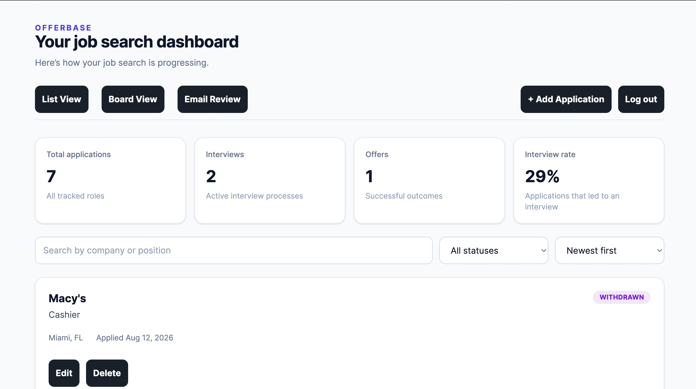
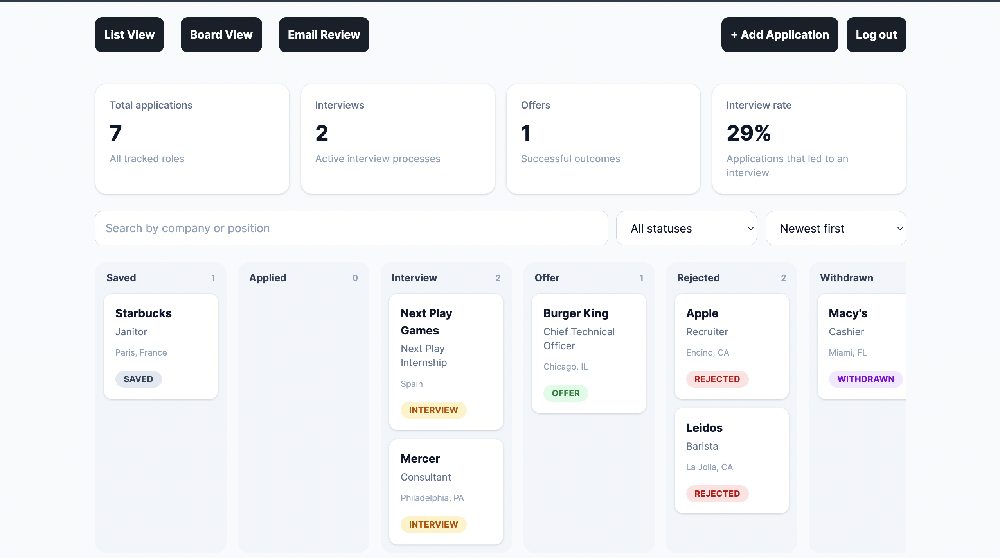

# offerbase
# OfferBase

OfferBase is an intelligent job application tracker that connects to Gmail, identifies recruiting emails, and converts them into structured application updates.

Instead of manually maintaining a spreadsheet, users can track applications in list and Kanban views while OfferBase detects application confirmations, interviews, offers, and rejections from incoming email.

## Screenshots

### Dashboard



### Kanban Board



## Features

- Secure JWT-based authentication
- Job application CRUD with PostgreSQL persistence
- List and Kanban-style application views
- Gmail integration through OAuth 2.0
- Historical Gmail import and incremental synchronization
- Duplicate email prevention
- Recruiting-email relevance filtering
- Hybrid rule-based and machine-learning email classification
- Automatic company and position extraction
- Matching recruiting emails to existing applications
- User-approved application creation and status updates
- Human-in-the-loop ML feedback collection
- Persistent application event timeline

## Machine Learning

OfferBase uses a Python/scikit-learn text-classification pipeline to classify recruiting emails into five categories:

- APPLIED
- INTERVIEW
- OFFER
- REJECTED
- OTHER

Email subject, sender, and body text are transformed using TF-IDF features and classified using logistic regression.

The trained model is served through a FastAPI inference service and consumed by the Spring Boot backend.

OfferBase combines the ML classifier with a deterministic rule-based classifier. High-confidence agreement can be accepted, while ambiguous or conflicting predictions can be routed for review.

During development, the classifier achieved 97% accuracy on a separate 30-email holdout set.

## Architecture

Frontend:
- React
- TypeScript
- Tailwind CSS

Backend:
- Java
- Spring Boot
- Spring Security
- JPA / Hibernate

Database:
- PostgreSQL

ML Service:
- Python
- scikit-learn
- FastAPI

Integrations:
- Gmail API
- Google OAuth 2.0

## Email Processing Pipeline

Gmail  
→ Recruiting relevance filter  
→ Rule-based classifier  
→ ML classifier  
→ Hybrid decision layer  
→ Company/role extraction  
→ Application matching  
→ User approval  
→ PostgreSQL update

After the initial Gmail import, OfferBase uses Gmail history IDs to process only newly received messages.

## Tech Stack

### Frontend
- React
- TypeScript
- Tailwind CSS
- Vite

### Backend
- Java
- Spring Boot
- Spring Security
- JPA / Hibernate
- Maven

### Machine Learning
- Python
- scikit-learn
- pandas
- FastAPI
- TF-IDF
- Logistic Regression

### Data & APIs
- PostgreSQL
- Gmail API
- OAuth 2.0
- REST APIs
- JWT

## Testing

The backend includes tests covering:

- Email classification
- Recruiting-email filtering
- Company and role extraction
- Application matching
- Email classification pipeline
- Spring application context


## Running Locally

### Prerequisites

Make sure you have the following installed:

- Java 17+
- Maven
- PostgreSQL
- Node.js and npm
- Python 3
- Conda

### 1. PostgreSQL

Create a PostgreSQL database named:

```text
offerbase
```

Configure your PostgreSQL username and password through environment variables used by the Spring Boot application.

### 2. Environment Variables

Set the following environment variables before starting the backend:

```bash
export DB_USERNAME=your_postgres_username
export DB_PASSWORD=your_postgres_password
export JWT_SECRET=your_base64_encoded_jwt_secret
export GOOGLE_CLIENT_ID=your_google_client_id
export GOOGLE_CLIENT_SECRET=your_google_client_secret
```

Google OAuth credentials can be created through the Google Cloud Console with access to the Gmail API enabled.

### 3. Start the Spring Boot Backend

From the project root:

```bash
cd backend
./mvnw spring-boot:run
```

The backend runs at:

```text
http://localhost:8080
```

### 4. Start the ML Classification Service

Open a second terminal:

```bash
cd backend/ml
conda create -n offerbase-ml python=3.12
conda activate offerbase-ml
conda install -c conda-forge pandas scikit-learn fastapi uvicorn requests joblib
uvicorn ml_api:app --host 127.0.0.1 --port 8001
```

If the Conda environment has already been created, you only need:

```bash
conda activate offerbase-ml
cd backend/ml
uvicorn ml_api:app --host 127.0.0.1 --port 8001
```

The ML service runs at:

```text
http://127.0.0.1:8001
```

### 5. Start the Frontend

Open a third terminal:

```bash
cd frontend
npm install
npm run dev
```

The frontend will be available at:

```text
http://localhost:5173
```

### 6. Use OfferBase

Open the frontend in your browser, create an account, and log in. Applications can be added manually or updated through recruiting emails after connecting a Gmail account.
